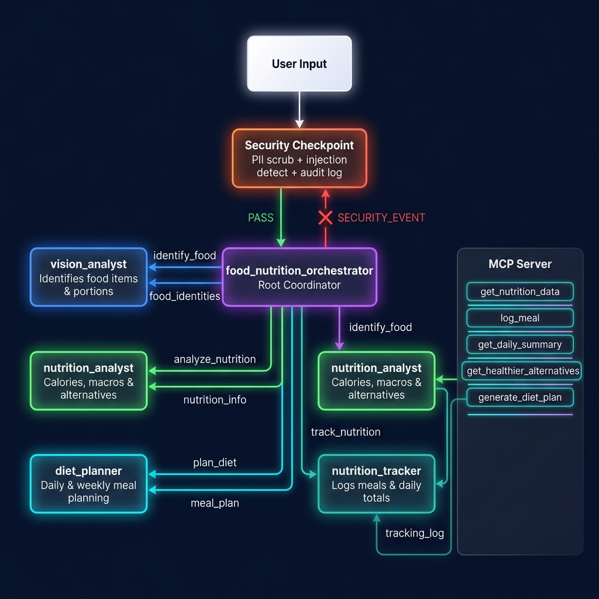
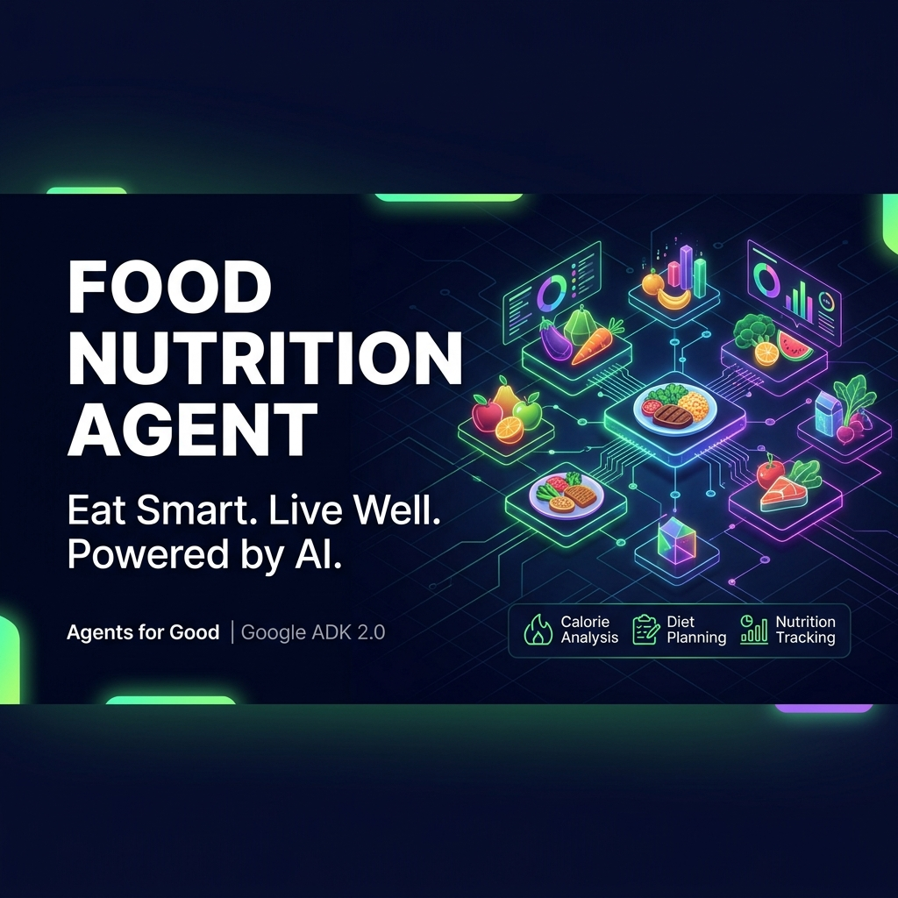

# 🥗 Food Nutrition Agent

> **Track:** Agents for Good | **Built with:** Google ADK 2.0 · MCP Server · Multi-Agent Workflow

An AI-powered nutrition assistant that analyzes your meal, estimates calories, suggests healthier alternatives, creates personalized diet plans, and tracks your daily nutrition — all in one conversation.

---

## Prerequisites

- Python 3.11+
- [uv](https://astral.sh/uv) — fast Python package manager
- Gemini API key → [aistudio.google.com/apikey](https://aistudio.google.com/apikey)

---

## Quick Start

```bash
git clone <repo-url>
cd food-nutrition-agent
cp .env.example .env   # add your GOOGLE_API_KEY
make install
make playground        # opens UI at http://localhost:18081
```

**Windows users** — if `make playground` fails, run directly:
```powershell
uv run adk web app --host 127.0.0.1 --port 18081 --reload_agents
```

---

## Architecture

```
┌─────────────────────────────────────────────────────────────────┐
│                    User Input (meal description/URL)            │
└───────────────────────────┬─────────────────────────────────────┘
                            │
                ┌───────────▼────────────┐
                │  Security Checkpoint   │  ← PII scrub + injection detect
                │  (function node)       │    + audit log (INFO/WARNING/CRITICAL)
                └───────────┬────────────┘
                       PASS │       SECURITY_EVENT → ❌ Blocked
                            │
                ┌───────────▼────────────────────────┐
                │   food_nutrition_orchestrator       │  ← LlmAgent (root)
                │   Coordinates all sub-agents        │
                └─────┬──────────┬──────┬────────────┘
                      │          │      │       │
           ┌──────────▼──┐  ┌────▼───┐ ┌▼──────────┐ ┌────────────▼──┐
           │ vision_     │  │nutri-  │ │diet_      │ │nutrition_    │
           │ analyst     │  │tion_   │ │planner    │ │tracker       │
           │             │  │analyst │ │           │ │              │
           │ Identifies  │  │Macros  │ │Weekly     │ │Logs meal     │
           │ food items  │  │& alts  │ │meal plan  │ │Daily totals  │
           └─────────────┘  └───┬────┘ └─────┬─────┘ └──────┬───────┘
                                │             │               │
                        ┌───────▼─────────────▼───────────────▼──────┐
                        │              MCP Server (stdio)              │
                        │  • get_nutrition_data                        │
                        │  • log_meal                                  │
                        │  • get_daily_summary                         │
                        │  • get_healthier_alternatives                │
                        │  • generate_diet_plan                        │
                        └──────────────────────────────────────────────┘
```

---

## How to Run

```bash
make playground   # → interactive UI at http://localhost:18081
make run          # → local FastAPI server at http://localhost:8080
make test         # → run unit tests
make lint         # → run ruff linter
```

---

## Sample Test Cases

### Test 1 — Calorie Estimation
```
Input:    "I just had 2 samosas and a cup of masala chai"
Expected: Vision analyst identifies samosas + chai → Nutrition analyst returns ~524 cal,
          health rating Yellow, suggests baked alternatives → Tracker logs to daily total
Check:    See breakdown with calories per item and 3 healthier alternatives
```

### Test 2 — Diet Plan Request
```
Input:    "I had pizza for lunch (2 slices). What should I eat for the rest of the day to stay under 2000 calories?"
Expected: Nutrition analyst computes ~532 cal for 2 pizza slices → Diet planner
          creates balanced dinner + snack plan with ~1468 cal remaining budget
Check:    Specific meal suggestions with portions for afternoon snack + dinner
```

### Test 3 — Daily Tracking
```
Input:    "Show me my nutrition progress for today"
Expected: Tracker agent retrieves all logged meals → Shows cumulative calories,
          macros, progress % toward 2000 cal / 50g protein / 250g carb goals
Check:    Goal completion percentages + motivational message
```

---

## Troubleshooting

| Error | Fix |
|-------|-----|
| `ModuleNotFoundError: google.adk` | Run `uv sync` inside the project folder |
| `404 model not found` | Check `.env` has `GEMINI_MODEL=gemini-2.5-flash` (not 1.5-*) |
| `Got unexpected extra arguments` (Windows) | Run `uv run adk web app --host 127.0.0.1 --port 18081 --reload_agents` directly |

---

## Push to GitHub

1. Create a new repo at https://github.com/new
   - Name: `food-nutrition-agent`
   - Visibility: Public or Private
   - Do NOT initialize with README (you already have one)

2. In your terminal, navigate into your project folder:
   ```bash
   cd food-nutrition-agent
   git init
   git add .
   git commit -m "Initial commit: food-nutrition-agent ADK agent"
   git branch -M main
   git remote add origin https://github.com/<your-username>/food-nutrition-agent.git
   git push -u origin main
   ```

3. Verify .gitignore includes:
   ```
   .env          ← your API key — must NEVER be pushed
   .venv/
   __pycache__/
   *.pyc
   .adk/
   ```

> ⚠️ **NEVER push `.env` to GitHub.** Your API key will be exposed publicly.

---

## Demo Script

See [DEMO_SCRIPT.txt](./DEMO_SCRIPT.txt) for a spoken narration script for presenting this project.

## Assets




